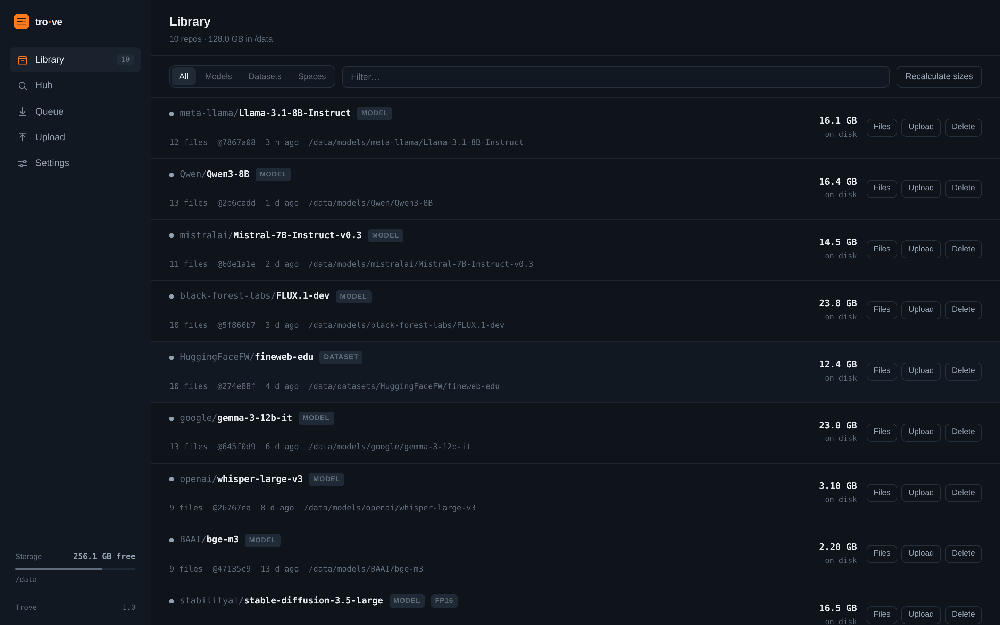
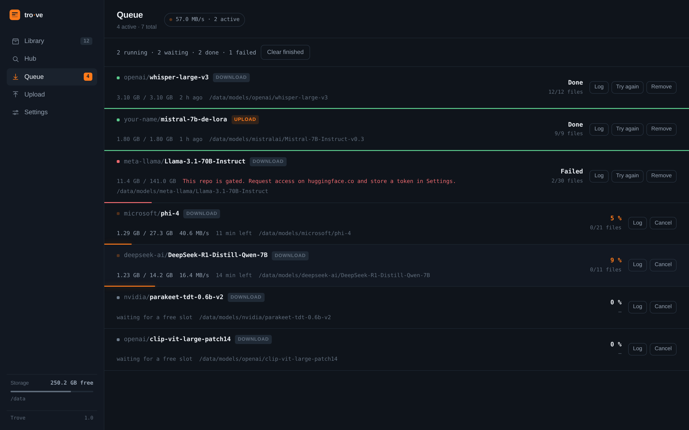
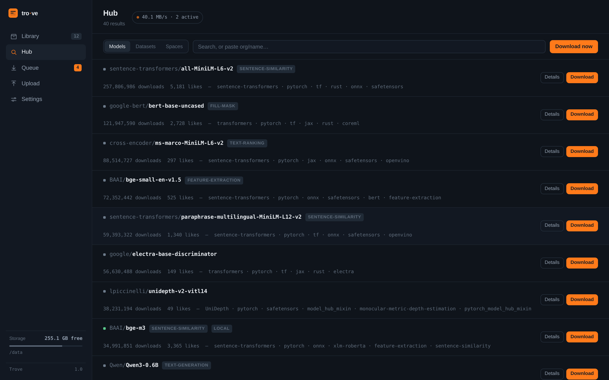
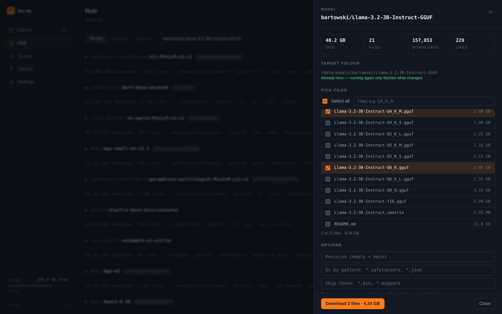
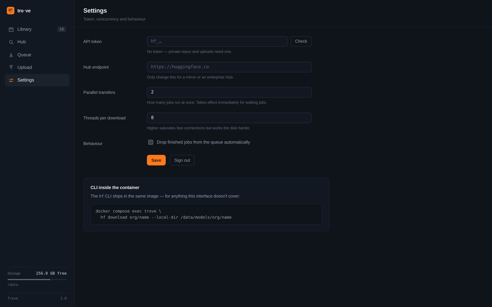

<div align="center">


# Trove

**A model library for your own server.**
Pull models and datasets off the Hugging Face Hub, keep them as plain files, and
watch every transfer while it happens.




</div>

## Why this exists

Models are big, connections are slow, and the machine you want them on is rarely
the machine you are sitting at. Trove runs on the NAS or the server where the
storage actually lives, so downloads happen there — in the background, on the
fast link, into a folder you already back up.

Over time that folder becomes something worth having: a collection of the models
you use, at the revisions you tested, still there after a Hub repo goes gated,
gets renamed, or disappears. Plain files in plain directories — no hashed cache,
nothing that needs a Python environment to read:

```
/data/models/meta-llama/Llama-3.1-8B-Instruct/
/data/models/Qwen/Qwen3-8B/
/data/datasets/HuggingFaceFW/fineweb-edu/
```

Point `llama.cpp`, vLLM, ComfyUI or an NFS share straight at them.

And you rarely want a whole repo. A quantised model repo routinely carries every
quant from `IQ3_M` to `f16` — tick the one you actually run and leave the other
38 GB on the Hub.

## What it does

<table>
<tr><td width="50%">

**Queue several transfers at once**
Start as many downloads as you like; Trove runs a couple in parallel and works
through the rest. Close the browser — the server keeps going. Restart the
container — unfinished transfers pick up where they left off.

</td><td width="50%">

**Watch them live**
Bytes, files, rate and time remaining, updated about once a second over a
WebSocket. Every row carries its own progress as its baseline, so a busy queue
reads at a glance.

</td></tr>
<tr><td>

**Take one file, not the whole repo**
A GGUF repo can hold twenty quants and 40 GB when you want a single 1.9 GB one.
Tick the files you want and only those come down. Split quants are listed as one
entry, so you always get every part.

</td><td>

**Upload, too**
Push a local folder back to the Hub, creating the repo if it doesn't exist,
public or private, with the same live progress.

</td></tr>
<tr><td>

**Keep the shelf tidy**
Sizes, file counts, revisions and commit hashes per repo. Inspect the files,
re-fetch what changed upstream, delete what you no longer need.

</td><td>

**The real CLI is still there**
`hf` ships in the same image. Anything the interface doesn't cover, you can do
by hand in the container — against the same folders.

</td></tr>
</table>

## Screenshots

<table>
<tr>
<td width="50%"><br><sub><b>Queue</b> — two running with rate and time left, two waiting, history below.</sub></td>
<td width="50%"><br><sub><b>Hub</b> — search results with downloads, likes and what you already have.</sub></td>
</tr>
<tr>
<td><br><sub><b>Pick files</b> — two quants ticked: 4.34 GB instead of 40.2 GB.</sub></td>
<td><br><sub><b>Settings</b> — token, endpoint, concurrency, threads per download.</sub></td>
</tr>
</table>

## Run it

### From the registry

Everything Trove keeps lives in two mounted folders, so point them at real
paths on the host and nothing of value ends up inside the container:

```bash
docker run -d --name trove \
  --restart unless-stopped \
  -p 127.0.0.1:7860:8000 \
  -e UI_PASSWORD=changeme \
  -e PUID=$(id -u) -e PGID=$(id -g) \
  -v /mnt/tank/models:/data \
  -v /mnt/tank/trove-config:/config \
  ghcr.io/15ky3/trove:latest
```

| Mount | Holds |
|---|---|
| `/data` | every model and dataset, as plain files under `models/` and `datasets/` |
| `/config` | settings, the API token and the queue state |

Swap `/mnt/tank/...` for wherever your storage actually is. `PUID`/`PGID` make
the downloaded files belong to you rather than to root — on macOS they do no
harm and can be left out.

Then open <http://127.0.0.1:7860> and sign in with the password you set. To
reach it from other machines on the network, publish it wider (`-p 7860:8000`)
and pick a password you would actually defend.

> [!IMPORTANT]
> **On a Synology — and most likely on any NAS — run this second container as
> well:**
>
> ```bash
> docker run -d --name rngd --restart unless-stopped --privileged \
>   debian:bookworm-slim \
>   sh -c 'apt-get update && apt-get install -y rng-tools5 && rngd -f'
> ```
>
> Without it the kernel runs out of entropy, OpenSSL refuses to open further TLS
> connections, and downloads stop dead after a few kilobytes — with no error
> message anywhere. The entropy pool belongs to the host kernel, so this cannot
> be solved from inside Trove. Check whether it applies to you with
> `cat /proc/sys/kernel/random/entropy_avail`; below ~200 means you need it,
> and a healthy value afterwards is close to 4096. Details in
> [Troubleshooting on a NAS](#troubleshooting-on-a-nas).

Synology accounts start at UID 1026, so `id -u` on the NAS gives you the values
for `PUID`/`PGID` — and shared folders carry ACLs that need their own entry.
Both are covered in the troubleshooting section too.

### With Compose

```yaml
services:
  trove:
    image: ghcr.io/15ky3/trove:latest
    container_name: trove
    restart: unless-stopped
    ports:
      - "127.0.0.1:7860:8000"
    environment:
      UI_PASSWORD: changeme
      PUID: 1000
      PGID: 1000
    volumes:
      - /mnt/tank/models:/data
      - /mnt/tank/trove-config:/config

  # On a NAS, add the entropy source from the note above:
  rngd:
    image: debian:bookworm-slim
    container_name: rngd
    restart: unless-stopped
    privileged: true
    command: sh -c 'apt-get update && apt-get install -y rng-tools5 && rngd -f'
```

### From source

```bash
git clone https://github.com/15ky3/trove.git
cd trove
cp .env.example .env
$EDITOR .env                 # UI_PASSWORD, DATA_DIR, PUID/PGID
docker compose up -d --build
```

The bundled `docker-compose.yml` takes both mount points from `.env`, so
`DATA_DIR=/mnt/tank/models` there does the same job as the `-v` flags above.

## Configuration

Everything lives in `.env`:

| Variable | Default | What it does |
|---|---|---|
| `UI_PASSWORD` | — | Password for the interface. Empty means no sign-in at all. |
| `DATA_DIR` | `./data` | Host folder for models, mounted at `/data`. |
| `CONFIG_DIR` | `./config` | Settings, token and queue state. |
| `BIND_ADDR` | `127.0.0.1` | Set to `0.0.0.0` to reach it from the network — set a password first. |
| `PORT` | `7860` | Port on the host. |
| `HF_TOKEN` | — | Optional starting token; what you enter in Settings wins. |
| `HF_ENDPOINT` | — | Only for a mirror or enterprise Hub. **Leave it commented out when unused** — an empty value confuses `huggingface_hub`. |
| `PUID` / `PGID` | `1000` | On Linux set these to `id -u` / `id -g` so downloaded files belong to you. |

The API token goes in under **Settings** rather than here, so it never sits in
your shell history or a compose file. It is stored in `CONFIG_DIR/settings.json`
with `0600` permissions and only ever sent back to the browser masked.

## The CLI in the same container

```bash
docker compose exec trove hf download org/name --local-dir /data/models/org/name
docker compose exec trove hf upload org/name /data/models/org/name
docker compose exec trove hf auth whoami
```

## How it works

```
app/
  main.py       FastAPI: REST, WebSocket broadcast, password session
  jobs.py       queue: concurrency, cancel, retry, persistence
  worker.py     one subprocess per transfer, reports progress as JSONL
  hub.py        search, repo info, token check
  storage.py    local library: list, size, delete
  static/       the interface (vanilla JS, no build step)
```

Every transfer runs as its **own process**, and that one decision buys most of
the behaviour above:

* `snapshot_download` cannot be interrupted — a process can. **Cancel** sends
  SIGTERM, finished files stay on disk, **Try again** resumes from there.
* Blocking network calls can never stall the server, so the interface stays
  responsive with a dozen transfers in flight.
* A transfer that crashes takes only its own process with it.

Progress comes from `huggingface_hub`'s own counters — downloads through the
documented `tqdm_class`, uploads through a hook into the live display of
`upload_folder`. If a future release changes that internal, uploads keep
working; they just lose the byte readout, and the job log says so.

The queue is stored in `CONFIG_DIR/jobs.json`, so it survives restarts:
interrupted transfers are re-queued and continue.

### Picking individual files

Ticking files in the detail panel is a friendlier front end for
`allow_patterns`: each name is turned into an exact pattern (glob characters in
a filename are escaped, so a literal `[` stays a `[`). Files split across parts —
`…-00001-of-00002.gguf`, `model-00001-of-00004.safetensors` — are grouped into a
single entry, because half of a split quant is worth nothing.

The selection is stored alongside the download, so **Refresh from Hub** on a
partial copy fetches the same files again instead of suddenly pulling the whole
repo. Partial copies are marked as such in the library.

### A Hub quirk worth knowing

Legacy short names like `bert-base-uncased` redirect to
`google-bert/bert-base-uncased`. The Xet storage endpoint does not follow that
redirect and returns a 404 partway through the download — this happens with the
official CLI too. Trove resolves every repo ID to its canonical form when
queueing, which also means typos and gated repos are reported immediately
instead of failing minutes later.

## Troubleshooting on a NAS

Two things bite specifically on NAS hardware. Both were found running Trove on a
Synology, and neither produces an obvious error message.

### Downloads stop after a few kilobytes

Small files arrive, then the job sits at `0.0 B/s` forever. Open the job and look
at the history — if it repeats

```
RNDGETENTCNT on /dev/urandom indicates that the entropy pool does not have
enough entropy. Rather than continue with poor entropy, this process will
block until entropy is available.
```

the kernel has run out of randomness and OpenSSL refuses to open further TLS
connections. Check it:

```bash
cat /proc/sys/kernel/random/entropy_avail   # below ~200 is the problem
```

NAS kernels usually expose no random number generator to userspace at all —
`/dev/hwrng` is missing — so the pool never refills under load, even though the
CPU itself can produce randomness. `rngd` from the rng-tools bridges that gap:

```bash
docker run -d --name rngd --restart unless-stopped --privileged \
  debian:bookworm-slim \
  sh -c 'apt-get update && apt-get install -y rng-tools5 && rngd -f'
```

The entropy pool belongs to the host kernel, which is why this has to run
alongside Trove rather than inside it, and why it needs full privileges to write
there. `entropy_avail` should jump to nearly 4096 within seconds. A log line
about `/dev/tpm0` is harmless — that is `rngd` probing for a TPM before falling
back to the CPU instruction (`rdrand` on Intel and AMD).

If your CPU has no `rdrand` (check with `grep -m1 rdrand /proc/cpuinfo`), `rngd`
will exit. The remaining option is to reseed from `/dev/urandom` by appending
`-r /dev/urandom` to the command. That reliably unblocks transfers, but it feeds
the pool with its own output, so the kernel's entropy accounting becomes
fiction. Fine for a box that downloads public models; do not do it on a machine
that generates keys.

Note that the container installs rng-tools on every start, so it needs internet
access at boot. Worth replacing with a purpose-built image if that bothers you.

### Permission denied on the mounted folder

Synology user accounts start at UID 1026 and sit in group `users` (GID 100),
while the container defaults to 1000:1000. Look yours up with `id` over SSH and
pass it in as `PUID`/`PGID`. Do not set a `user:` in Compose or Container
Manager — the container has to start as root so it can switch to those IDs.

Shared folders additionally carry Synology ACLs, which override ordinary Unix
permissions. If access is still refused, check what the folder actually grants:

```bash
synoacltool -get /volume1/Models
```

An entry for `administrators` alone is not enough for a container running as a
normal user. Add one for yours — through Control Panel → Shared Folder →
Permissions, or directly:

```bash
synoacltool -add /volume1/Models "user:yourname:allow:rwxpdDaARWc--:fd--"
synoacltool -enforce-inherit /volume1/Models   # apply to existing content
```

## Security

* The container runs as an unprivileged user.
* Repo IDs and paths are validated against directory traversal; deleting and
  uploading only ever touch `/data`.
* The token is passed to worker processes through the environment, never as a
  command-line argument where `ps` would show it.
* There is no multi-user model here. Anyone who can reach the port and knows the
  password can download, upload and delete. Keep it behind your own network or a
  reverse proxy with TLS.

## License

MIT
